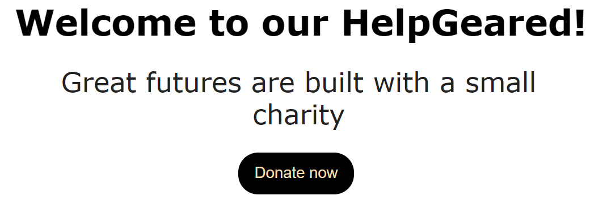
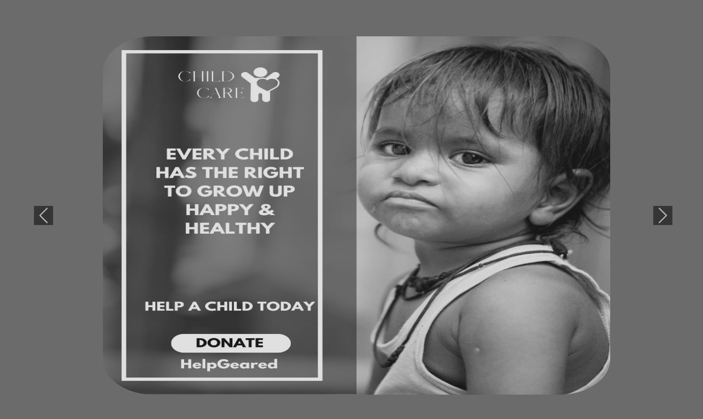
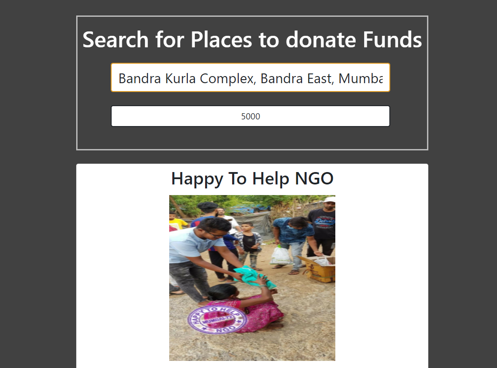
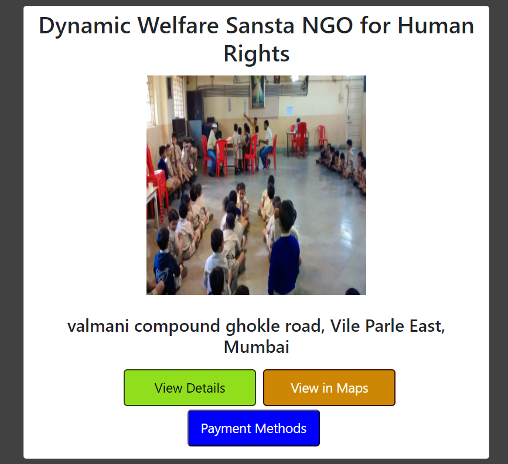

# HelpGeared



A Google DSC Solution made to provide a centralized platform that provides comprehensive information on NGOs and orphanages in specific areas, making it easy for users to find and donate to them. Our goal is to facilitate a transparent and accountable donation process that builds trust between donors and recipients.


## Video Submission

You can checkout our video submission demo on youtube by clicking on the thumbnail below.

<a href="http://www.youtube.com/">
                                                                                
</a>

## Project Info

The contents in this project follow the below structure

```
├───Home
|
├───About
│   ├───Motive
│   └───Developer's_info
|
├───Donate
│   ├───Donate Food
|   |   ├───NGO, Orphanages List
|   |   ├───Place Details
|   |   └───Amount Donation
|   | 
|   ├───Donate Clothes
|   |   ├───NGO, Orphanages List
|   |   ├───Place Details
|   |   └───Amount Donation
|   |
|   └───Donate Funds
|       ├───NGO, Orphanages List
|       ├───Place Details
|       └───Amount Donation        
|
└───Contact Us

```
## Description

- Our solution is mainly backed by Node.js and the Front-End is    written in HTML, CSS, JavaScript along with the usage of Bootstrap Framework.

- For fetching the List of NGOs and Place Details we have extensively used Google Places API available in the Google Cloud Console.

- We have also implemented User Authentication using OAuth 2.0 fulfilled by the Google Cloud Console.

## Website Snippets

<br><br>
<br><br>
<br><br>
<br><br>
<br><br>


 
## API Reference

#### Get the Places List and Details

```http
  GET https://maps.googleapis.com/maps/api/js?key=YOUR-API-KEY&libraries=places&callback=initMap
```

| Parameter | Type     | Description                |
| :-------- | :------- | :------------------------- |
| `api_key` | `string` | **Required**. Your API key |


## Deployment

Clone the Repository

```bash
  git clone https://github.com/Sujal-2820/Google-Solution-Challenge.git
```

Move to the desired Folder

```bash
  cd \Google-Solution-Challenge
```

Install Node Packages

```bash
  npm install
```

Run the Web Application

```bash
  nodemon index.js
```

## About

Our platform aims to ensure that vulnerable individuals have access to essential resources such as food, funds, and clothes, and that no one is left behind.

Through our platform, users can easily find and donate to NGOs and orphanages that serve these communities, providing them with the essential resources they need to survive and thrive.

We understand that access to food, funds, and clothes is essential to their survival and well-being, and we are committed to ensuring that no one is left behind.

#### Made with ♥ by 

<p align="left">
<a href="https://github.com/Sujal-2820"></a>
<a href="https://github.com/silky-modi22"></a>
<a href="https://github.com/sudhanshujoshi95"></a>
</p>

## Authors

- [@Sujal Soni](https://github.com/Sujal-2820)
- [@Silky Modi](https://github.com/silky-modi22)
- [@Sudhanshu Joshi](https://github.com/sudhanshujoshi95)


